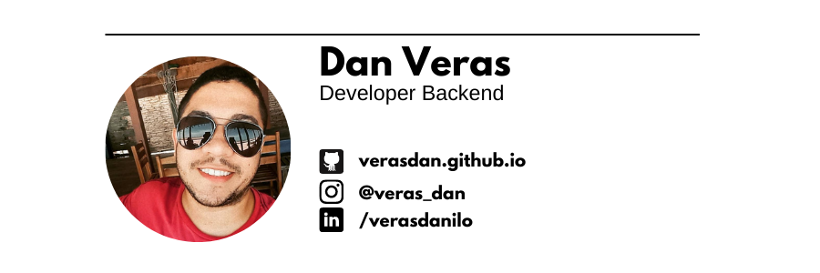

<h1 align="center">
  
</h1>

Apaixonado por programação e marketing digital. Atualmente ando desenvolvendo pequenos trabalhos como freelancer na área de Desenvolvedor Backend e atuando em pequenos projetos em Marketing de Conteúdo.

 

 

  
### 🔨 Languages and Tools:

 </a>

<!--   -->

 

### Learning:

 

 

## 📊 GitHub Status

 
  

  

  

 

## 🔥 Streak stats

<!-- GitHub Readme Streak Stats - https://github.com/veradan/github-readme-streak-stats -->

  

<!-- detalhes -->

  
 --------- 💥 Working on ---------

 

  

    &ensp;
    
  

  

  

  
  

